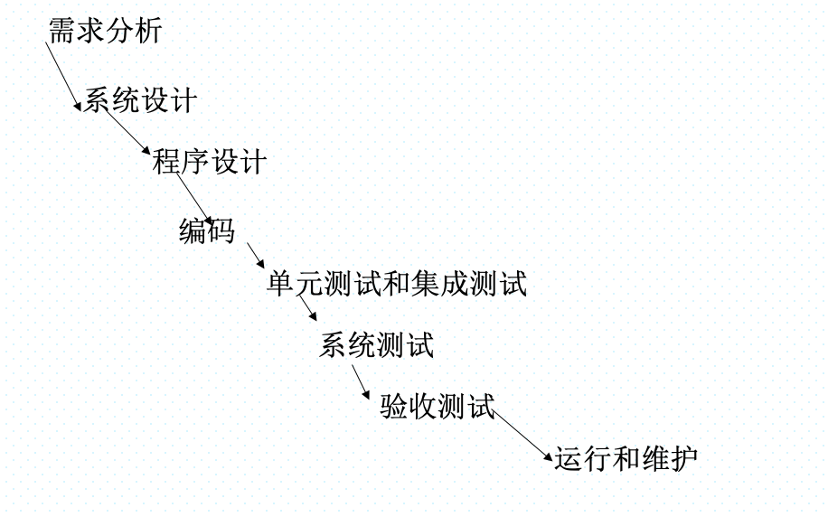
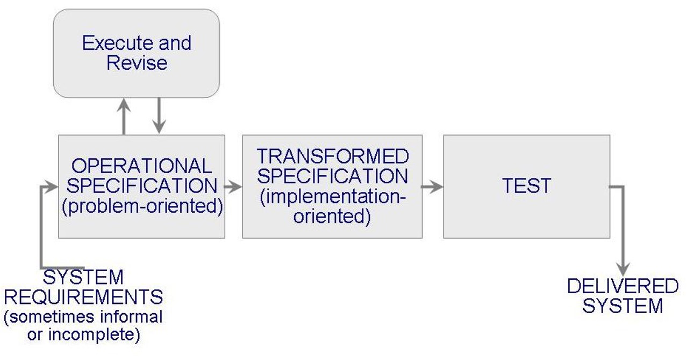

# 软件工程概述

## 1.什么是软件？

是一系列按照`特定顺序组织`的计算机`数据`和`指令`的集合，包括`程序、数据和文档`。

>   重点是软件还包含数据以及文档，不只有程序

## 2.什么是软件危机，其内容主要是指什么？

`软件危机`是指`落后的软件生产方式`无法满足`迅速增长的计算机软件需求`，从而导致软件开发与维护过程中出现一系列严重问题的现象。

主要内容：

-   `项目超时和超预算`：对项目预期没有良好的估计
-   `软件质量低下`：错误频发，缺乏有效质量保证和测试标准
-   `维护困难，维护成本不断提高`：设计的时候短视，编码低效率
-   `缺乏通用标准和方法论`

>   就想象一下自己编程遇到的问题，突然发现做不完了，钱不够了，写出了垃圾代码，自己都看不懂，改不了，也不知道怎么评价一个程序好坏。

## 3.什么是软件工程？

>   软件工程因为软件危机的产生而出现

**软件工程是应用计算机科学、数学及管理科学等原理开发软件的工程。它借鉴传统工程的原则、方法，以提高质量，降低成本为目的。**

软件工程是一个涉及软件的`开发`、`维护`、`管理`和`设计`的工程学科。它应用工程原则于软件的开发中，以确保软件是高效、可靠、可维护、符合成本效益和满足用户需求的。

## 4.软件工程的目标及其组成部分

软件工程的**目标**是：在给定`成本`、`进度`的前提下，开发出具有`适用性`、`有效性`、`可修改性`、`可靠性`、`可理解性`、`可维护性`、`可重用性`、`可移植性`、`可追踪性`、`可互操作性`和`满足用户需求`的软件产品。

>   目标就是：保证软件质量，满足客户需求，成本控制得住，软件可以维护，还能按时交付（单押！！！）

**组成部分：**

**软件工程`三要素`：`方法`、`工具`和`过程`**

- `方法`：产生某些结果的形式化过程
- `工具`：用更好的方式完成某件事情的设备或者自动化系统
- `过程`：生产特定产品的工具和技术的结合
- `范型`：构造软件的特定方式或哲学

## 5.软件开发方法的定义

`软件开发方法`就是从`技术上`为构建软件提供解决方法（如何做），涉及`沟通、需求分析，设计建模，编程，测试和技术支持`等方面。

## 6.好的软件的一些主要衡量指标（例如McCall 的质量模型）

衡量指标：

`对不对：`正确性，可靠性，完整性

`好不好：`效率，可使用性

`测试维护能力：`可测试性、可维护性、灵活性

`拓展能力：`可移植性、可复用性、互联性

McCall质量模型：

# 过程和生命周期建模

## 1.什么是软件生命周期？主要分为哪些阶段？各个阶段的主要任务及产生的主要制品？区分软件工程和软件过程。

### 软件生命周期

软件孕育、诞生、成长、成熟和衰亡的生存过程，我们称这个过程为软件生命周期或软件生存期。

### 可行性研究

- 任务：了解用户要求和现实环境，从技术、经济、市场等方面研究并论证开发该软件系统的可行性
- 阶段性产品：`可行性论证报告`、`初步项目开发计划`

### 需求分析

- 任务：确定用户对待开发软件系统的功能需求、非功能性需求，运行环境约束。
- 阶段性产品：`软件需求规格说明书SRS`

### 概要设计

- 任务：根据SRS建立目标软件系统总体结构、设计全局数据库和数据结构，规定设计约束，制定继承测试计划等等
- 阶段性产品：`概要设计规格说明书`、数据库或数据结构设计说明书、继承测试计划

### 详细设计

- 任务：细化概要设计生成的各个模块，并详细描述程序模块的内部细节，形成可编程的程序模块，制定单元测试计划。
- 阶段性产品：`详细设计规格说明书`、单元测试计划

### 实现阶段

- 任务：根据详细设计规格说明书编写源程序，进行调试和单元测试，验证程序与详细设计文档的一致性。
- 阶段性产品：`源程序代码`

### 集成测试

- 任务：根据`概要设计规格说明书`，将通过单元测试的木块逐步进行集成和测试
- 阶段性产品：生成满足概要设计要求、`可运行的系统源程序和系统集成测试报告`

### 确认测试

- 任务：根据软件`需求规格说明书`，测试软件系统是否满足用户需求
- 阶段性产品：`可供使用的软件产品`（文档、源程序）

### 软件维护

- 任务：对使用后的软件进行维护（修正错误，增加新功能，环境迁移）
- 阶段性产品：`新版本的软件产品`

### 软件工程与软件过程的区别：

-   **范围**：软件工程是一个更广泛的领域，包括软件过程、项目管理、技术实践等多方面内容。软件过程更专注于开发过程本身。
-   **焦点**：软件工程关注整个软件开发生命周期的所有方面，包括技术和管理。软件过程主要关注开发活动的组织和管理。
-   **目的**：软件工程的目标是提供高质量的软件，确保项目的成功。软件过程着重于定义和改进开发软件的步骤和方法。

## 2.可行性研究及需求分析的定义

上面有，这里进一步补充：

可行性分析：

-   技术可行性
-   经济可行性
-   操作可行性
-   社会可行性

>   理论上能不能做，够不够钱做，实际上能不能做，社会给不给做

需求分析：

-   功能性需求
-   非功能性需求
-   运行环境约束

>   功能性就是具体的功能点，非功能性就是功能的具体表现形式，比如运行实现要短，运行环境约束就比如必须要用国产平台系统等等。

## 3.典型的软件开发过程模型的特点（优缺点、文档评审和里程碑等）及要求，特别是原型法、瀑布模型、螺旋模型、增量和迭代等。

### 瀑布模型：由文档驱动的模型（重点）

特点：

- 采用结构化方法
- 阶段之间有顺序性和依赖性，强调每一个阶段的顺序
- 推迟实现的观点
- 没有循环

优点：采用规范的方法；严格规定每个阶段提交的文档；要求每个阶段交出的产品必须经过验证。适合用户需求完整，无重大变化的开发。

缺点：对开发中的变化没有提供指导，没有迭代，到有成果需要等待很长时间。

### 原型化模型

也就是快速开发一个软件的初步版本，这个版本称之为原型，这样早期就能看到并体验软件的部分功能

- 允许需求或设计反复调查，减少开发中的风险和不确定性

优点：提高用户满意度，用户直接参与开发过程，有利于早点发现需求并解决

存在的问题：

- 为了让原型尽快工作，没有考虑软件的总体质量和长期可维护性
- 为了掩饰，可能选取一些不理想的组成部分，然后这些部分成为了系统的一部分
- 开发过程不便于管理

建造原型仅仅是为了定义需求，之后被抛弃。

### 可操作规格说明

早开发过程早期检查需求及其隐含意义，功能和设计可以合并。

### 可转换模型

- 减少主要开发步骤
- 应用一系列的转换将需求规格说明变成一个可交付使用的系统
- 形式化开发记录
- 形式化规格说明

### 阶段化开发：增量和迭代

- 减少循环时间
- 系统一部分一部分交付
- 有产品系统和开发系统，可以并行

#### 增量模型

#### 增量与迭代：（重点）

增量：将系统分为多个块，每次增量地开发一个块

迭代：先搭好框架，然后逐步填充，但是每一次出来的都是可用的

优点：灵活，即使，用户参与，逐步交付，易于测试

缺点：对框架设计提出高要求，整体一致性问题等

### 螺旋模型（重点）

围绕四个主要活动，在六个象限上螺旋旋转：

- 用户通信
- 计划
- 确定目标、可选方案、约束
- 评估可选方案和风险
- 开发和测试
- 用户评估

优点：有利于软件冲用，减少了过多的测试或者测试不足，维护和开发没有本质区别。

特点：风险驱动，适合内部开发的大规模软件项目，随着迭代次数增加，工作量加大，成本上升。

### 喷泉模型

特点：主要用于支持面向对象开发过程。

## 4. 原型法的特点以及分类：探索型原型、实验型原型和演化型。

### 原型法的特点

1.  **快速反馈和迭代**：通过快速开发原型，可以及时获得用户反馈，并在此基础上进行迭代改进。
2.  **用户参与**：用户直接参与原型的评估，有助于确保产品符合他们的实际需求。
3.  **需求澄清和验证**：原型有助于在开发早期澄清和验证需求，避免需求误解。
4.  **风险降低**：通过提前揭示设计问题和需求不一致，有助于减少开发后期的风险。
5.  **灵活性**：原型法提供了修改设计的灵活性，以更好地适应用户的需求变化。

### 原型法的分类

1.  **探索型原型（Exploratory Prototyping）**：需求都不知道
    -   **目的**：主要用于帮助理解用户的需求和期望。
    -   **特点**：在需求定义不清晰的早期阶段使用，帮助开发团队和用户一起探索需求。
    -   **应用场景**：适用于新领域的软件开发，或者用户和开发者都不太清楚具体需求的情况。
2.  **实验型原型（Experimental Prototyping）**：需求知道了，看行不行对不对
    -   **目的**：用于测试某些软件设计或概念的可行性。
    -   **特点**：重点是验证技术选择、算法、策略等是否可行。
    -   **应用场景**：适用于技术创新或需要验证新技术的项目。
3.  **演化型原型（Evolutionary Prototyping）**：后面还能用
    -   **目的**：原型不仅用于需求的收集和验证，而且是最终产品的一部分。
    -   **特点**：原型在整个项目生命周期中不断演化，直到成为最终产品。
    -   **应用场景**：适用于需求频繁变更或需要持续用户参与的项目。

## 5.敏捷开发方法和极限编程的特点，基本原则有哪些。

### 敏捷方法：主打一个快

建立及时的反馈机制，强调人与人之间的直接沟通，轻文档，重合作，专注于对变化的适应

#### 特点：

1.  **迭代和增量开发**：敏捷方法强调短周期的迭代和逐步的软件交付。
2.  **客户合作**：密切与客户合作，迅速响应客户需求的变化。
3.  **适应性强**：能够快速适应需求和环境的变化。
4.  **人本主义**：重视个人和团队交流，而非过度依赖工具和流程。
5.  **持续改进**：鼓励团队成员不断反思并改善开发过程。

>   短期有成效，重视客户的合作，重视团队沟通，对变化适应性强

#### 基本原则：

1.  **客户满意度优先**：通过持续交付有价值的软件来确保客户满意。
2.  **欢迎变化**：即使在开发后期也能适应需求变更。
3.  **频繁交付软件**：定期交付可以工作的软件版本。
4.  **紧密合作**：业务人员和开发者必须在项目中日常合作。
5.  **支持和信任**：建立团队的自组织和动力。
6.  **面对面沟通**：直接沟通是效率最高的信息传递方式。
7.  **可持续开发**：保持开发速度以确保可持续性。
8.  **关注技术卓越**：持续追求技术改进和优良的设计。
9.  **简洁**：最大化不做工作的艺术。
10.  **自我组织团队**：团队具有自我组织和调整的能力。
11.  **反思调整**：定期反思并调整行为以提高效率。

>   就是多和甲方沟通，甲方是爸爸，甲方需求变了我也能满足，频繁交付给甲方
>
>   自己内部多沟通多合作，大家互相信任，形成一个好的团队，还会反思
>
>   追求好的技术，希望可持续开发，追求简洁
>
>   

### 极限编程（XP）

强化沟通，简化设计，迅速反馈。

四个核心要点：交流、简单、反馈、勇气

#### 特点：

1.  **代码质量**：强调编写清晰、简洁且可维护的代码。
2.  **持续集成**：代码频繁且定期地集成到主分支。
3.  **测试驱动开发**（TDD）：先编写测试，然后编写能通过测试的代码。
4.  **配对编程**：两名程序员共同在一台计算机上工作，提高代码质量和团队协作。
5.  **简单设计**：采用最简单但可行的设计方案。
6.  **重构**：不断重构代码以提高其结构和可维护性。

#### 基本原则：

1.  **沟通**：项目成功的关键在于团队成员之间的有效沟通。
2.  **简单性**：选择最简单的解决方案。
3.  **反馈**：通过测试和用户反馈来调整开发方向。
4.  **勇气**：敢于面对挑战和变化，即使是重构现有系统。
5.  **尊重**：团队成员之间相互尊重，共同推动项目成功。

>   就是一个敢说一个敢做，情绪稳定，经常有反馈。还真能有成果，真的太勇了！

## 6. CMM/CMMI及其层次划分。

### CMM能力成熟度模型

1.  **初始级（Initial）**：研0菜狗啥也不会瞎搞
    -   过程通常是不可预测的、不受控制的和反应式的。
    -   项目经常超时和超预算。
2.  **可重复级（Repeatable）**：有经验了，可以复现论文了
    -   已建立基本的项目管理过程。
    -   可以重复早期成功的项目。
3.  **已定义级（Defined）**：懂得写论文的规范了
    -   组织已经建立了一套标准的软件过程。
    -   所有项目都遵循这套标准过程。
4.  **可管理级（Managed）**：开始用数据写论文了
    -   组织收集详细的度量信息。
    -   过程和产品的质量受到量化控制。
5.  **优化级（Optimizing）**：还懂得论文润色了
    -   不断改进过程。
    -   强调过程效率和持续改进。

### CMMI集成能力成熟度模型

### CMMI（集成能力成熟度模型）

CMMI是CMM的后继者，由SEI开发，结合了多个先前的模型。CMMI不仅适用于软件工程，还扩展到了系统工程和其他业务领域。CMMI同样分为五个成熟度级别：

1.  **初始级（Initial）**
2.  **管理级（Managed）**
3.  **已定义级（Defined）**
4.  **量化管理级（Quantitatively Managed）**
5.  **优化级（Optimizing）**
