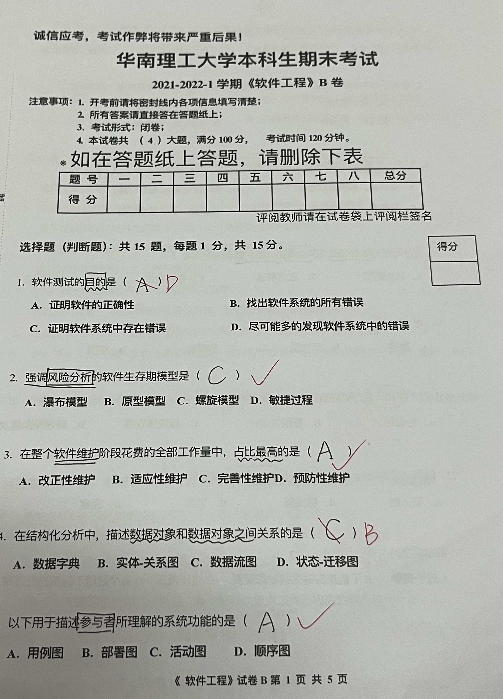

（GPT版答案）
2.开发一个陪小朋友聊天的“智能机器人”软件项目，为了加强软件质量保障，综合运用软件工程概论所学知识，采用软件工程方法进行策划、分析、设计和测试，要求必须给出：
a)	项目名称（命名）
b)	项目理解描述
c)	需求分析
d)	概要设计
e)	主要质量保障措施和方法  

a) 项目名称：小朋友聊天机器人

b) 项目理解描述：小朋友聊天机器人是一款基于人工智能技术的软件，旨在为小朋友提供一个可以陪伴聊天的虚拟机器人。该软件可以通过语音识别和自然语言处理技术，与小朋友进行对话，并根据小朋友的需求和兴趣提供相应的回答和建议。该软件的目标用户是年龄在3-10岁的小朋友，可以在家庭、幼儿园或学校等场合使用。

c) 需求分析：

1. 功能性需求：

- 支持语音识别和自然语言处理技术，可以与小朋友进行对话；
- 提供多样化的聊天话题，包括儿童故事、儿歌、游戏、问答等；
- 根据小朋友的需求和兴趣，提供个性化的回答和建议；
- 支持语音合成技术，可以将回答转化为语音输出；
- 支持多语言，可以根据用户的语言环境自动切换语言；
- 提供用户管理功能，支持用户注册、登录、退出等操作；
- 支持数据统计和分析功能，可以分析用户的聊天记录和偏好，为后续优化提供数据支持。

2. 非功能性需求：

- 可靠性：软件需要具有高可靠性，保证在各种情况下都能正常运行；
- 易用性：软件需要具有良好的用户体验，易于操作和使用；
- 安全性：软件需要具有良好的安全性，保护用户的个人信息和隐私；
- 可维护性：软件需要易于维护和修改，方便后续的版本升级和功能扩展；
- 性能：软件需要具有较高的性能，可以快速响应用户的请求和操作。

d) 概要设计：

1. 架构设计：

- 采用客户端-服务器架构，客户端负责与用户进行交互，服务器负责处理用户的请求和提供数据支持；
- 采用微服务架构，将不同的功能模块拆分为独立的服务，方便后续的维护和扩展。

2. 模块设计：

- 语音识别模块：负责将用户的语音转化为文本；
- 自然语言处理模块：负责分析用户的文本，提取关键词和语义，生成回答和建议；
- 语音合成模块：负责将回答和建议转化为语音输出；
- 数据库模块：负责存储用户信息和聊天记录；
- 用户管理模块：负责处理用户注册、登录、退出等操作；
- 统计分析模块：负责分析用户的聊天记录和偏好，为后续优化提供数据支持。

e) 主要质量保障措施和方法：

1. 单元测试：对每个模块进行单元测试，确保各个模块的功能和性能符合要求；
2. 集成测试：对不同模块之间的接口和交互进行集成测试，确保系统的功能和性能符合要求；
3. 系统测试：对整个系统进行功能测试、性能测试、压力测试等，确保系统的质量和可靠性；
4. 用户测试：邀请目标用户进行测试，收集用户反馈和意见，优化软件的用户体验和功能；
5. 代码审查：对代码进行定期审查，发现和纠正潜在的问题和缺陷；
6. 配置管理：使用配置管理工具对软件的版本和配置进行管理，确保软件的稳定性和一致性；
7. 文档管理：对软件的设计文档、测试文档、用户手册等进行管理，方便后续的维护和升级。

