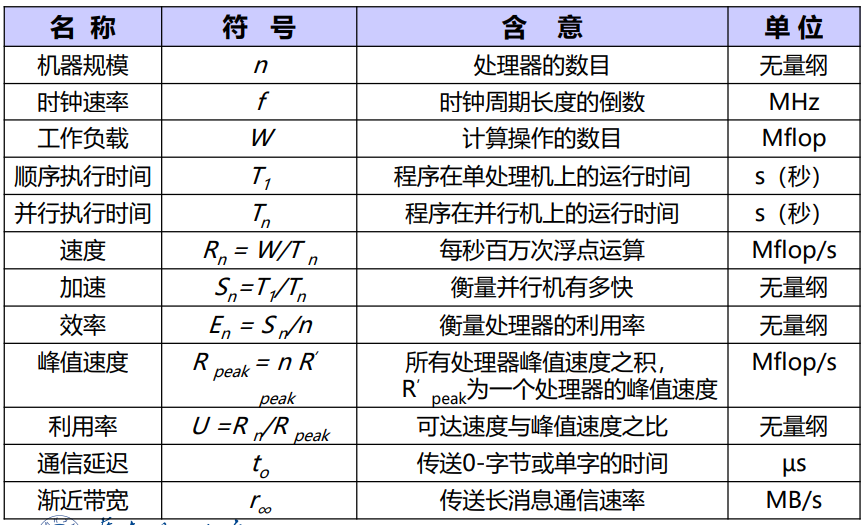

# 并行计算概述

**应用场景**：计算能力、存储效率、网络IO、时间延迟

**并行计算机的发展**

## 什么是并行计算

- 并行计算：高性能计算（high performance computin）、超级计算（super computing）

  `大任务--（分解）-->多个子任务--（分给）-->不同处理单元--（协同合作）-->快速求解`

- 基本条件（硬件、算法、环境）

  - 硬件（并行机）：多态处理机互联网络连接通信
  - 并行算法设计
  - 并行编程环境

- 主要目标：提高求解速度、扩大问题规模（又快又大）

## 并行计算vs分布式计算

- 分布式计算distributed computing：多个处理机执行相互依赖的**不同应用**，协调资源访问
- 并行计算parallel computing：提高求解**同一个应用**的速度、扩大求解**同一个应用**的问题规模
- 并行和分布式相互配合，分布式协调不同应用关系，并行提高求解单应用能力

**HPC硬件平台架构**

# 并行计算体系结构（1）

## 并行计算网络概述

- 并行计算机网络性能指标：

  - 节点度node degree：射入或射出一个结点的边数
  - 网络直径network diametert：网络中任何两个节点之间的最长距离**（最大路径数，越小越好）**
  - 对剖宽度bisection width：**对分**网络成两半移去的**最少边数（最大流最小割，越大越稳定）**
  - 网络是对称symmetry的：从任一节点观看网络都一样
  - 对剖带宽bisection width：最小对剖平面的最大数据带宽（bps或Bps，越高越好）
  - 网络规模：网络节点（CPU）总数

- $total\_latency=sender\_overhead+time\_of\_flight+message\_size/BW+receiver\_overhead$

  - overhead：接口延迟
  - latency：网络

  

  

## 静态互联网络

- 定义：处理单元之间**固定连接**的网络，点到点连接保持不变

- 静态网络：

  - 一维线性阵列：最简单最基本，左右近邻连接（**二近邻连接**）

    - $N$个节点，$N-1$条边，内节点度$2$，直径为$N-1$，对剖宽度为$1$
    - 首尾相连，构成循环移位器（**环**），可以单向或双向
      - 节点度$2$，直径为$\lfloor N/2\rfloor$（双向环）或$N-1$（单向环），对剖宽度$2$

  - 二维网孔 2-D mesh：每个节点和**上下左右节点近邻连接**（边界除外）

    - 网络规模：$N$，节点度$4$，网络直径$2(N^{1/2}-1)$，对剖宽度$N^{1/2}$
    - illiac网孔：垂直方向上**带环绕**，水平方向**蛇状连接**
      - 网络规模：$N$，节点度$4$，网络直径$N^{1/2}-1$，对剖宽度$2N^{1/2}$
    - 2-D环绕：垂直和水平都**带环绕**
      - 网络规模：$N$，节点度$4$，网络直径$2\lfloor N^{1/2}-1)\rfloor$，对剖宽度$2N^{1/2}$

    

  - 二叉树：

    - 节点度：$3$，对剖宽度：$1$，树的直径：$2*k-2=2(\lceil log_2N\rceil -1)$

    - 星形网络：节点度$N-1$，直径$2$，对剖宽度$\lfloor N/2\rfloor$

    - 叶节点对应**并行机**的节点，内节点负责叶节点之间的**通信**

    - 网络直径$2logP$有利于全局通信，对剖宽度$1$不利于大数据量通信

      - 胖树：通路从叶节点向根节点逐渐变宽，解决通信带宽瓶颈

        

  - 超立方：

    - 节点用n位0-1编码，两个节点编号**数码不同位数**表示**两节点的距离**

    - 节点度：$d$，不利于增加并行机规模，一般$d<5$

    - 网络直径：$logP$，对剖宽度：$2^{d-1}$，性质很好

      

    - 3-D 环绕：3d超立方+2-D环绕

    - k-立方环：以环代替顶点，$N=k2^k,d=k$

    

## 动态互联网络

- 定义：节点之间**无固定物理连接**，交叉点处用电子开关、路由器、仲裁器提供**动态连接**

- 多处理及总线系统的主要问题：

  - 总线仲裁、中断处理、协议转换、快速同步、高速缓存一致性协议、分事务、 总线桥、层次总线扩展

- 单一总线

  - 连接处理器、存储、IO
  - 公用总线，以时钟为一个周期，分时占有
  - $总线带宽=总线主频*总线宽度，1.2GB/s=150MHz*64b$
  - 采用公平的**监听协议和仲裁算法**

- 交叉开关

  - 所有节点通过**交叉开关阵列**连接，每个开关为两个节点的**专用通路**

  - 构成$N\times N$阵列，最多只能连通$N$对节点，提供$2N$个端口

  - 一端连接处理器，一端连接存储器，只允许**一对一或一对多的映射**，防止冲突

  - 单级交换网络：提供更高的带宽

    

- 多级互联网络

  - 多级互联网络multistage interconnection network：单级交叉开关级联

    

    

  - 均匀洗牌

  - 蝶网

    

  - 多路均匀洗牌

  - 交叉开关

  - 立方连接

  

## 标准实现

- Myrinet

- HiPPI

- Scalable Coherent Interface(SCI)

- QsNet

- RDMA(remote direct memory access)：直接内存间进行数据互传的技术，降低cpu消耗，低时延

  - RoCE、iWARP，基于以太网的RDMA技术

    - 基于TCP的RDMA，将”无损“寄托在TCP的可靠性上
    - 而基于RoCEv2的无损网络，将”无损“放在流控机制上

    

  - Infiband：专门为RDMA设计的网络，硬件级别可靠传输

- HPC网络：AI Fabric的目标，无丢包、低时延、高吞吐

# 并行计算体系结构（2）

## Flynn分类

指令流/数据流分类法：flynn分类法

- 指令流 instruction stream：指令序列
- 数据流 data stream：输入数据和中间结果
- 多倍性 multiplicity：系统**性能瓶颈上**同时处于同一执行阶段的指令和数据的**最大可能个数**

计算机系统按照flynn分类分为：

- 单指令单数据流SISD系统：单处理器，指令串行

- 单指令多数据流SIMD系统：单一指令控制多个处理单元，处理多个数据流

  - 系统结构：一个控制器、多个处理器、存储模块、互联总线
  - 代码举例：
    - 原理：支持将数据打包在大型寄存器中进行处理的指令集，适合数据密集型操作
    - 使用方法：编译器自动向量化优化，改写循环体

- 多指令单数据流MISD系统：多个指令同时处理同一数据流

- 多指令多数据流MIMD系统：多处理机系统

  - MIMD和SIMD 的区别：处理器异步vs同步，连接网络使用异步vs同步

    

## 内存访问模型

- **组成要素：**处理器processor、互联网络interconnect network，内存memory
- 并行机基本特征：多个计算单元和存储模块，通过互联网络耦合
  - 紧耦合和松耦合

- 共享内存vs分布式内存

  

### 共享内存

- 紧密耦合多处理器，所有处理器都可以访问的全局物理内存
  - 对称性：系统中任何处理器都可以访问任何内存单元、IO设备
  - 单地址空间
  - 低通信延迟：处理器通过共享内存数据交换
  - 高速缓存机器一致性：多级高速缓存支持数据局部性，硬件增强一致性

### 分布式内存

- UMA（uniform memory access）**均匀存储**访问模型

  

  - 特点：

    - memory被所有processor**均匀共享**
    - 所有processor访问任何存储字去**相同时间**
    - 每个processor有私有cache
    - IO以一定形式共享
    - **访存竞争**时，仲裁策略**平等对待**每个节点

  - 对称多处理symmetric multiprocessing，SMP：微处理器和高速缓存

    

    - memory和processor对称分布在interconnect network两侧
    - 特点：
      - 对称共享存储：任何processor可以直接访问memory和IO，**统一编址**，仲裁公平
      - 单一的操作系统映像：全系统只有一个os**驻留在SM**中，根据processor的负载，**动态分配进程**到processor，保持处理器负载均衡
      - 局部高速缓存cache和数据一致性：每个processor都有局部**cache**，cache数据和SM**数据一致**
      - 低通信延迟：处理器通信通过读写os提供的SM缓存区，延迟小于网络通信
      - 共享总线带宽
      - 支持消息传递、共享存储、并行程序设计

  - 并行向量处理机parallel vector processor，PVP：高性能向量处理器VP

    

- NUMA（non-uniform memory access）非均匀存储访问模型

  

  - 被共享的memory在物理上分布在各自的processor中，所有**本地memory的集合**组成**全局地址空间**

  - processor访问memory**时间不一样**，有私有chache

    - 缓存一致性得到维护，CC-NUMA
    - 缓存一致性无法维护，NCC--NUMA

  - DSM distributed shared memory

    - 内存模块在各个节点内部，被所有节点共享

    - **和SMP的相同点**

      - 单一os
      - 基于cache的数据一致性
      - 低通信延迟，高通信带宽
      - 支持消息传递、共享存储并行程序设计

    - 物理上分布存储：

      内存模块分布在各个节点中，通过高性能互联网络连接，**避免SMP访存总线的带宽瓶颈**

    - 单一的内存地址空间

    - 非一致内存访问NUMA模式：远端访问通过网络，比本地访问慢3倍以上

- COMA（cache-only memory access）全高速缓存存储访问

  

  - 没有存储层次结构，**所有节点的cahce**构成全局地址空间

- CC-NUMA（coherent-cahce nonuniform memory access）高速缓存一致性非均匀存储访问模型

  

  - 和SMP结构一样，**易于编程**，可扩放性

  - 系统硬件软件**自动**在各节点分配数据，保持一致性，无需程序员参与

- NORMA（noremote memory access）：非远程存储访问模型

  

  - 分布式内存系统中处理器有各自的内部寄存器

  - 一个核的内存地址对其他核不可见，对于所有CPU**没有单一全局地址空间**

  - 优点

    - 内存大小和CPU数量等比例增加
    - 访问自己的内存，无冲突、无维护缓存一致性的开销

  - 缺点：

    - **程序员参与**processor之间数据通信细节
    - 在基于全局内存空间的数据结构上，建立分布式内存管理**映射困难**
    - 由于非一致性的内存访问，访问远程节点**时间更长**

  - **大规模并行处理机**massively parallel processor，MPP（NORMA）

    

    - 每个节点相对独立，有多个微处理器、局部cache、独立的操作系统映像、独立编址
    - 节点间用局部高性能网卡NIC互联，仅支持消息传递或高性能Fortran并行程序设计，不支持全局共享的OpenMP并行设计

  - **集群/机群** cluster、COW

    

    - 松耦合、分布式存储
    - 优点：系统结构灵活、性价比高，缺点：通信性能、并行编程环境

  - MPP vs Cluster

    - cluster有完整的os，MPP只有微内核
    - cluster有本地磁盘，MPP没有
    - cluster节点连接到IO总线上（松耦合），MPP节点连接到存储总线上（紧耦合）

  

- 实例：SGI Origin2000（CC-NUMA）、Blue Gene（MPP）、Roadrunner（Cluster）

## 内存体系结构

- 存储层次

  

- cache类别：L2在节点内部，L1在处理器内部（连接寄存器和L2 cache）

- 编写高性能并行程序解决方案

  - cache的映射策略

    - 以cache线（line）为基本存储单位，包含$L$个字，$L\times 8$个字节
      内存以块（block）为基本存储单位，包含$L$个字，$L\times 8$个字节
    - `for(int i=0; i < M; i++) { a(i) = a(i) + 5.0 * b(i); } `有无cache的访存次数分别为$2M/L, 2M$

    - 直接映射策略，k-路组关联映射策略，全关联映射策略
  - cache线置换策略
    - LRU，least recently used，没使用时间最长
    - FIFO
    - LFU，least frequently used，使用频率最低
    - 随机算法
  - cache数据一致性策略
    - write-through策略：cache线数据一旦被修改，立刻写回内存块，增加了访存次数
    - write-back策略：当且仅当cache线被置换、或外部请求访存，将cache线写回内存

- 一致性包括**cache一致性和存储一致性**

  - cache一致性：私有cache副本数据和共享memory数据的一致性

    - 特征：多处理器对同一memory单元操作
    - 原因：cache写回更新策略引起

    

  - memory一致性：多处理器程序**执行次序**和共享memory**存取次序**间的一致性

    - 特征：多处理器对不同memory单元操作
    - 原因：处理器内部优化执行效率（异步流水线）引起

    

- cache一致性协议

  - 总线监听一致性协议：每个Cache块设有状态，各节点**监听总线上的总线事务**、并根据Cache块 状态控制(基于作废/更新)其状态变化(状态转换图)
  - 目录一致性协议：在每个宿主**共享存储器单元(块)上建立一个目录**，记录使用该单元的**所有处理器(Cache)信息和数据状态信息**，宿主节点根据这些信息实现(基于作废/更新)各 Cache的一致性。
  - 一致性协议性能参数：扑空率、更新速率、流量
    - 影响因素：cache容量、块大小、一致性粒度

- 节点内部或节点之间的内存访问模式

## 处理器、协处理器与异构计算

# 并行计算模型及性能评测

并行计算模型：将并行计算机的基本特征抽象出来，形成一个**抽象**的计算模型，作为并行算法分析、设计、性能预测的基础

## PRAM模型

- 概念：SIMD-SM模型，**一个指令控制器和一个共享memory**，通过SM的R/W交换数据，隐式同步计算

  

- 分类：**exclusive（独立）、concurrent（同步）**

  - PRAM-CRCW并发读并发写：最高效单需要解决冲突
    - CPRAM-CRCW（common PRAM-CRCW），仅允许写入相同的数据
    - PPRAM-CRCW（priority PRAM-CRCW），仅允许优先级最高的处理器写入
  - PRAM-CREW并发读互斥写：默认
  - **PRAM-EREW**互斥读互斥写：最低效最现实
  - 计算能力：PRAM-EREW可以$logp$倍模拟PRAM-CREW和PRAM-CRCW
    - $T_{EREW}\ge T_{CREW}\ge T_{CRCW}$
    - $T_{EREW}=O(T_{CREW}\cdot logp)=O(T_{CRCW}\cdot logp)$

- 例子

  - 序列递归求和

  

  PEREW机器时间复杂度$O(logn)$？

  - 向量内积

  

- 优点：适合并行算法表示和复杂性分析，易于使用，隐藏了并行机通讯、同步细节

  缺点：不适合MIMD并行机，忽略了SM竞争、通讯延迟因素

- 异步APRAM模型

  - 基本概念：phase分相 PRAM或MIMD-SM
    每个处理器有局部的存储器、时钟、程序，无全局时钟，处理器异步执行
    处理器通过SM通信，需要在并行程序中显式地加入同步路障

  - 指令类型：全局读、全局写、局部操作、同步

  - 计算过程：由**同步障**分开的**全局phase**组成

    

  - 计算时间：局部操作为**单位时间**，全局读/写平均时间为$d$（$d$随着处理器数目增加增加），**同步路障时间**为$B=B(p)$非降函数，全局phase内个处理器**执行时间最长**为$t_{ph}$，APRAM计算时间为$T=\Sigma t_{ph}+B\times 同步障次数$

  - 优点：易于编程、分析复杂度，缺点：不适合MIMD-DM模型

## BSP模型

- 概念：”块“同步模型，block synchronized process，异步MIMD-DM模型
  支持消息传递系统、块内异步并行、块间显式同步

- 模型参数：处理器数（带存储器）$p$，同步障时间barrier synchronization time $l$，带宽因子（$time steps/packet=1/bandwidth$）$g$

- 

- BSP时间复杂度：

  - Valiant的原始版本：$max\{w,gh,l\}$，堆叠的通信和计算
  - McColl的修改版本：$w+gh+l$

- 用例

  - 向量内积

    

    

- 优点：强调计算通讯的分离，提供易于编程的环境和程序复杂性分析
  缺点：显式同步机制，限制最多$h$条消息的传递

- BSP vs PRAM：BSP是一般化的PRAM

  - BSP如果$g=1$，等价于PRAM

## logP模型

- 概念：**分布存储的、点到点通讯**的多处理机模型，**隐式同步**

- 模型参数：网络延迟network latency $L$，通信开销communication overhead $o$，每个处理器的通信带宽（处理器两次连续通信的最小距离）$g: gap=1/bandwidth$，处理器$P$
  其中$L,g$反映了网络通信的容量

- 特点：

  - 异步模型asynchronous：无同步障、复杂算法设计

  - 网络容量$network capacity=L/g$：最多$L/g$的信息可以从任何处理器传到另一个处理器，需要设置多线程限制

  - 端到端：$L+2o$
    读取远程位置：$2L+4o$
    预取prefectching：$2o$

  - 发送$n$条信息messages**花费$2o+L+g(n-1)$**

    最优广播树optimal brodcast tree

    

  - 优点：捕捉了MPC的通讯瓶颈，隐藏了并行机的网络拓扑、路由、协议，可以应用到共享存储、消息传递、数据并行的编程模型中
    缺点：难以进行算法描述、设计和分析

  - BSP vs LogP

    - BSP块同步--->BSP子集同步--->BSP进程对同步=LogP
    - BSP可以常数因子模拟LogP，LogP可以对数因子模拟BSP
    - BSP=LogP+Barrieres-Overhead
    - BSP便于编程，LogP利用机器资源效率更高
    - LogP使用基于成对异步pairwise synchronization消息传递
    - LogP多了参数传输开销overhead

- 总结

  - PRAM：设计高效并行算法的简单、最好的概念模型，关注负载均衡
  - BSP（bulk synchronous parallel）：计算后通信，循环loop（**superstep、barrier synch、communicate**）
  - LogP：延迟latency，开销overhead、通信带宽gap、处理器P

## 性能评测

### 概述

性能评测（performance evaluation）：性能评价和性能分析

机器级性能评测：CPU和存储器的基本性能指标、并行和通信开销分析；并行机的可用性和好用性；机器成本、价格和性价比

算法级性能评测：加速比、效率、扩展性

程序级性能评测：基准程序benchmark

计算机性能

- 性能performance：单位$/s$
- 程序执行时间elapsed time：用户响应时间（IO时间+访存时间+CPU时间+OS开销）
- CPU时间：CPU工作时间

工作负载workload和速度

- 工作负载：百万浮点计算数MFLOP、百万指令数MI

- 速度：MFLOPS，MIPS

  

**加速比（speedup）**：$S_p=\frac{sequential\ execution\ time}{parallel\ execution\ time}$，串行、并行时间比（加速了多少）

**并行效率（parallel efficiency）**：$Efficiency=\frac{Speedup}{Number\ of\ processors}$

### 加速比性能定律

超线性加速比（S>p）：

- **Amdahl定律：固定规模的加速比**
  - 处理器数$P$
  - 问题规模$W$
    - 应用程序中的串行分量$W_s$
    - 串行分量比例$f=W_s/W,\ W_1=W_s+W_o$
    - 应用程序可并行化部分$W_p$，并行分量比例$1-f$
    - $W=W_s+W_p$
  - 串行执行时间$T_s=T_1$，并行执行时间$T_p$
  - 加速比$S$，效率$E$
  - 出发点：固定不变的负载均衡，分布在多个处理器上，**增加处理器**来加快执行速度
  - **固定规模fixed-size的加速比**：$performance=\frac{work}{time}$
    $speedup(p)=\frac{performance(p)}{performance(l)}=\frac{time(l)}{time(p)}$
  - $S=\frac{W_s+W_p}{W_s+W_p/p}=\frac{1}{f+\frac{1-f}{p}}=\frac{p}{1+f(p-1)}\rarr \frac{1}{f}\ as\ p\rarr \infin$
    - 如果f=10%，则最大加速比是10
  - 增强的Amdahl定律：**考虑开销$W_o$**
    - $S=\frac{W_s+W_p}{W_s+W_p/p+W_o}=\frac{W}{fW+\frac{W(1-f)}{p}+W_o}=\frac{p}{1+f(p-1)+W_op/W}\rarr \frac{1}{f+\frac{W_o}{W}}\ as\ p\rarr \infin$
- **Gustafson定律：固定时间的加速比**
  - $S=\frac{Work(p)}{Work(l)}=\frac{W_s+pW_p}{W_s+W_p}=f+p(1-f)=p-f(p-1)$（有p个处理器）
  - 增强的Gustafson定律：考虑开销$W_o$
    - $S=\frac{W_s+pW_p}{W_s+W_p+W_o}=\frac{f+p(1-f)}{1+W_o/W}$
- **Sun&Ni定律：**
  - $S=\frac{Work(p)/Time(p)}{Work(l)/Time(l)}=\frac{f+(1-f)G(p)}{f+(1-f)G(p)/p}$
  - 特点
    - $G(p)=1$是Amdahl加速定律
    - $G(p)=p$变为$f+p(1-f)$，就是Gustafson加速定律
    - $G(p)>p$，计算机负载比存储要求增长块，S加速比高于A加速比和G加速比

### 可扩展性评测标准

- 可扩展性

  - 影响加速比的因素：**系统规模和问题规模**

  - 对并行系统，在系统规模和数据规模变化时的执行时间更有意义

  - 三种量化方式：

    - 等效率测度efficiency metrics：效率，加速比/处理器数
      $E=\frac{S}{p}=\frac{1}{1+\frac{W_o}{W}}$

      

      

    - 等速度测度speed metrics：速度，每秒处理的数据量
      $\overline{V}=\frac{V}{p}=\frac{W}{pT} $

    - 平均时延测度latency metrics：时延，理想并行时间和实际并行时间的差距

### 基准测试程序

# 并行算法设计

## 设计方法

串行算法的直接并行化

从问题描述开始设计并行算法

借用已有的算法求解新问题

## 设计技术

### 平衡树方法balanced trees method

### 倍增技术doubling techiques

### 分治策略divide-and-conquer strategy

### 划分原理partitioning principle

### 流水线技术pipelining techniques

## 设计过程

PCAM设计方法学

划分

通信

组合

映射

# 并行程序设计基础

## 矩阵乘法

## Cannon

## DNS

## 并行程序设计概述

## 并行程序设计基本问题

## 并行程序设计模型

# 共享存储编程

## 多线程

## OpenMP Classic

## OpenMP Offload

# 消息传递编程：MPI

## MPI概述

## MPI并行编程

## MPI编程样例