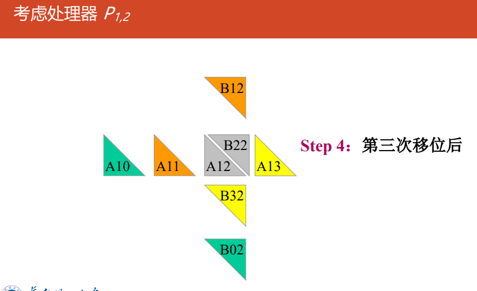

# 并行算法设计

- 并行算法的定义和分类

  - 并行算法：一组可同时执行且相互协作的进程集合
  - 分类：
    - 数值算法：基于代数
      非数值算法：搜索、排序、选择、匹配
    - 同步算法：进程需要相互等待
      异步算法
    - 分布式算法：不同引用场景
    - 确定算法：过程、结果或时间复杂度确定
      非确定算法：随机算法、智能算法

- 并行算法复杂性度量

  - 运行时间$t(n)$：n为问题规模、处理器数量$p(n)$、成本$c(n)=t(n)p(n)$
    成本最优性：$c(n)$在最差情况下等于串行算法需要的时间

  - 加速比$S_p(n)=t_s(n)/t_p(n)$，$S_p(n)=p(n)$线性加速，>超线性加速

    并行效率$E_p(n)=S_p(n)/p(n)$，范围为0~1，处理器的利用率

    工作量$W(n)$，并行算法执行的总操作步数

    Brent定理：$t(n)=O(W(n/p+T(n))$

设计方法

设计技术

平衡树方法balanced trees method

倍增技术doubling techiques

分治策略divide-and-conquer strategy

划分原理partitioning principle

流水线技术pipelining techniques

## 设计过程

### PCAM设计方法学

设计并行算法的四个阶段：partitioning、communication、agglomeration、mapping

- 将给定任务划分成小的任务，域分解或功能分解法
- 分析任务间的通信需求
- 使用组合方法。在保持灵活性的同时，减少通信和开发成本
- 将任务分配给处理器，使用负载均衡和任务调度技术提高映射质量，最小化总的执行时间


### 划分

- 划分方法描述

  - 开拓算法的并发性和可扩放性
  - 两类划分：域分解domain decomposition/数据分解、功能分解functional decomposition
  - 先数据分解，再功能分解
  - 使数据集和计算机互不相交
  - 划分阶段忽略处理器数目和目标机器的体系结构

- 域分解

  - 划分对象：数据（输入、中间处理、输出数据）

  - 分解结果：大致相等的小数据片

  - 划分时应该考虑数据上的操作

  - 如果一个任务需要别的任务的数据，会产生任务间通信

  - 三维网格的与分解：各格点上的计算重复

    

- 功能分解：更深层次的分级

  - 划分对象：计算
  - 划分后，研究不同任务需要的数据
    - 数据不交互，划分成功
    - 数据重叠，重新域分解和功能分解

  - 实例

    

  - 划分标准：

    - 灵活性：划分任务数>处理器数
    - 可扩放性：避免冗余计算、存储
    - 均衡：划分的任务尺寸
    - 任务数和问题尺寸成比例
    - 多种不同划分法

### 通信

- 通信方法描述：

  - 通信是PCAM设计过程的重要阶段

  - 划分产生的任务：任务间数据交流，产生通信

  - 功能分解确定了任务间的数据流

  - 任务是并发执行的，通信限制了任务并发

- 四种通信模式

  - 局部/全局通信 local/global communication

    - 局部：限制在邻域内，和近邻通信

      

    - 多任务参与，非局部，比如 all to all、master-worker

      

  - 结构化/非结构化通信 structure/unstructured

    - 结构化：通信模式相同

      

    - 非结构化：没有统一的通信结构

      

  - 静态/动态通信 static/dynamic

    - 静态：通信伙伴身份不变
    - 动态：通信伙伴身份随运行时数据改变

  - 同步/异步通信 synchronous/asynchronous

    - 同步：双方知道何时通信，发送方显示的发给接受方
    - 异步：不确定，接受方明确得从发送者请求数据

- 通信标准

  - 可扩放性：所有任务执行一样多的通信
  - 每个任务尽可能与少量近邻通信，局部通信
  - 通信操作可并行
  - 不同任务计算可并行

### 组合

- 方法描述

  - 组合：抽象到具体的过程，组合任务在并行机上有效执行
  - 合并小尺寸任务，减少任务书，任务书==处理器数
  - 增加任务粒度和重复计算，减少通信成本
  - 映射和扩展的灵活性，降低软工成本

- 组合例子

  

  - 表面-容积效应 surface-volume effects

    - 通信量——任务子集的表面：正比
    - 计算量——任务子集的体积：正比
    - 增加重复计算——>减少通讯量

    

  - 重复计算

    

    

  - 重复计算减少了通信量，但增加了计算量，应该保持恰当的平衡
    重复计算的目标：减少算法运行的总运算时间
  
- 组合判据

  - 增加粒度：减少通信成本
  - 重复计算：权衡得益
  - 保持灵活性和可扩展性
  - 成比例的组合任务数和问题尺寸


### 映射

- 方法描述

  - 每个人物映射到具体的处理器上，定位到运行机器上
  - 任务数>处理器数时，存在负载平衡和任务调度问题
  - 映射目标：减少算法的执行时间
    - 并发度任务——>不同的处理器
    - 任务之间存在高通信的——>同一处理器
  - 映射是一种权衡，属于NP完全问题

- 映射策略

  - 增强并发性concurrency：任务被不同的处理器并发执行
  - 增强局部性locality：通信频繁的任务放在同一个处理器上

  

- 负载平衡算法

  - 静态：实现确定
  - 概率：随机确定
  - 动态：执行期间动态负载
  - 基于域分解：
    - 递归对剖
    - 局部算法
    - 概率方法
    - 循环映射

- 任务调度算法

  - 将任务放在集中或分散的任务池中，使用任务调度算法将池中的任务分配给特定的处理器

  - 经理/雇员模式

    

  - 非集中模式：分布式调度，每个处理器维护一个任务池

- 映射判据

  - 采用集中式负载均衡方案，是否存在通信瓶颈
  - 采用动态负载平衡方案，调度策略的成本如何

# 并行程序设计基础

## 矩阵乘法

- 普通串行算法运行时间：$O(n^3)$

- 并行算法

  - 简单分块算法
  - Cannons
  - DNS

- 矩阵分块

  - 分块：$A、B、C$分成$p=\sqrt{p}\times\sqrt{p}$的方块阵$A_{ij}、B_{ij}、C_{ij}$大小均为$\frac{n}{\sqrt{p}}\times\frac{n}{\sqrt{p}}$

  - $p$个处理器编号为$(P_{0,0},...P_{\sqrt{p}-1,\sqrt{p}-1})$，$P_{i,j}$存放$A_{ij}、B_{ij}、C_{ij}$

    

- 简单并行分块算法

  - $P_{i,j}$存放$A_{ij}、B_{ij}、C_{ij}$($n >> p$)
  - 算法
    - 通信：
      每行处理器进行$A$矩阵块的多到多播送，得到$A_{i,k}，k=0\to \sqrt{p}-1$
      每行处理器进行$B$矩阵块的多到多播送，得到$B_{k,j}，k=0\to \sqrt{p}-1$
    - 乘-加运算：$P_{i,j}$做$C_{i,j}=\Sigma^{\sqrt{p}-1}_{k=0}{A_{ik}\cdot B_{kj}}$

  

## Cannon


- 算法

  1. 对准：

     所有块$A_{ij}(0\le i,j \le \sqrt{p}-1)$向左循环移位$i$步

     所有块$B_{ij}(0\le i,j \le \sqrt{p}-1)$向上循环移位$j$步

  2. 对所有处理器$P_{i,j}$做执行$A_{i,j}$和$B_{i,j}$的乘-加运算

  3. 移位：

     $A$的每个块向左循环移动一步

     $B$的每个块向上循环移动一步

  4. 转到2执行$\sqrt{p}-1$次





- Cannon分块乘法

  //输入：$A_{n\times n},B_{n\times n}$   输出：$C_{n\times n}$
  Begin
  		(1) for $k=0 \to \sqrt{p}-1$ do 
  				for all $P_{i,j}$ par-do
  						(i) if $i>k$ then 
  								$A_{i,j}\leftarrow A_{i,(j+1)mod\sqrt{p}}$
  						end if
  						(ii) if $j>k$ then
  								$B_{i,j}\leftarrow B_{(i+1)mod\sqrt{p},j}$
  						endif
  				endfor
  		endfor
  		(2) for all $P_{i,j}$ par-do $C_{i,j}=0$ endfor
  		(3) for $k=0 \to \sqrt{p}-1 $do
  				for all $P_{i,j}$ par-do
  						(i) $C_{i,j}=C_{i,j}+A_{i,j}B_{i,j}$
  						(ii) $A_{i,j}\leftarrow A_{i,(j+1)mod\sqrt{p}}$
  						(iii) $B_{i,j}\leftarrow B_{(i+1)mod\sqrt{p},j}$
  				endfor
  		endfor
  End

- 复杂度分析

  - 算法有$\sqrt{p}$次循环
  - 每次循环中，有$(n/\sqrt{p})\times(n/\sqrt{p})$的矩阵乘法：$\Theta(n^3/p^{3/2})$
  - 计算复杂度：$\Theta(n^3/p)$
  - 在每个循环，每个处理器发送和接受两个大小为$(n/\sqrt{p})\times(n/\sqrt{p})$的数据块
    每个处理器的通信复杂度：$\Theta(n^2/p)$
  - 串行算法：$\Theta(n^3)$
  - 并行开销：$\Theta(n^2\sqrt{p})$

## DNS

DNS矩阵乘法思路：利用更多的处理器达到更高的加速比

DNS矩阵分块

- 基本思想：通过一到一和一到多的播送方法，使得处理器$(k,i,j)$拥有$a_{i,k}、b_{k,j}$，再进行本地相乘，再沿着$k$方向进行单点积累求和，结果存储在处理器$(0,i,j)$中
- 处理器编号：处理器数$p=n^3 =(2^q)^3=2^{3q}$，处理器$P_r$位于位置$(k,i,j)$，这里$r=kn^2+in+j,(0\leq i,j,k\leq n-1)$
  位于$(k,i,j)$的处理器$P_r$的三个寄存器$A_r,B_r,C_r$分别表示为$A[k,i,j],B[k,i,j],C[k,i,j]$，初始均为0


- DNS矩阵算法描述

  算法：初始时$a_{i,j}$和$b_{i,j}$存储于寄存器$A[0,i,j]$和$B[0,i,j]$

  - 数据复制：A、B同时在k维复制（一到一播送）
    A在j维复制（一到多播送），B在i维复制（一到多播送）
  - 相乘运算：所有处理器的A、B寄存器两两相乘
  - 求和运算：沿k方向进行单点积累求和


## 并行程序设计概述

## 并行程序设计基本问题

## 并行程序设计模型


# 共享存储编程

## 多线程

- OpenMP 结构：三个API组成，编译制导compiler directives、运行库例程runtime library routines、环境变量environment variables

  

- 特性：

  - 标准化：为各种共享内存、架构平台提供标准，线程编程的高级接口
  - 精简：简单有限的共享地址空间指令编程，3~4条指令
  - 易于使用：增量并行化串行程序，实现不同粒度任务并行化
  - 可移植性：

- 编程模型programming model：

  - 基于线程的并行性
    多个线程的共享内存进程
    显式并行：程序员可控
  - 基于编译器指令
    通过编译器指令指定并行
  - 支持嵌套并行
  - 动态线程

- fork-join model：所有OpenMP程序从单个顺序进程开始，主进程：

  1. 在并行结构开始时分叉fork：
     1. 创建一组并行线程
     2. 并行区域构造并行执行的语句
     3. 并行执行
  2. 在并行结构结束时合并join：
     1. 在线程完成并行结构体语句后同步并终止
     2. 只存在主线程

- 通常的代码结构

  ```c++
  #include <omp.h>
  void saxpy(){
      float a, x[ARRAY_SZ], y[ARRAY_SZ];
      // 开始并行结构体
      #pragma omp parallel
      {
          int id=omp_get_thread_num();
          int nthrs=omp_get_num_threads();
          for(int i=id;i<ARRAY_SZ;i+=nthrs){
              y[i]=a*x[i]+y[i];
          }
      }
  }
  ```

- 术语terms

  - 结构construct：`{并行块}`
  - 指令（制导）directive：`#pragma omp 标识符`，该指令指定程序行为
  - 团队（线程组）team：合作的多个线程
  - 并行区域、串行区域
  - 私有private：私有变量命名一个存储块，对引用线程唯一
  - 共享shared：team中的所有线程可访问该存储块

## OpenMP Classic

指令（制导）格式：`#pragma omp 指令名 [子句claus,...] 新行newline`

- `#pragma omp`OpenMP的C++制导开始符号
- 指令名：有效的OpenMP指令，比如`parallel、for、sections、single`
- `claus`：指令的附加参数，设置属性或控制结构的行为，
- newline：换行符，表示指令结束

```c++
#pragma omp parallel default(shared) private(beta, pi)

//创建并行区域并对for并行，使用4个线程，动态调度线程，块大小为5
#pragma omp parallel for num_threads(4) schedule(dynamic, 5)
for (int i = 0; i < N; ++i) {
    // 并行执行的for循环体
}
```

### 并行域

parallel region

- 执行多线程的代码块，基础OpenMP并行结构，格式：

  ```c++
  #pragma omp parallel [clause...] newline
  	if(scaler_expression) //满足一定条件才使用并行区域
      private(list)  //私有变量
      shared(list)  //共享变量
      default(shared|none)  //变量默认共享属性
      firstprivate(list)  //每个私有变量初始值是主线程中的值
      reduction(operator:list)  //执行规约操作
  
  //在一个并行区域内对数组求和
  #include <omp.h>
  #include <stdio.h>
  
  int main() {
      int sum = 0;
  
      #pragma omp parallel if(omp_get_num_threads() > 1) \
          private(sum) \
          shared(sum) \
          default(none) \
          reduction(+:sum)
      {
          int tid = omp_get_thread_num();
          printf("Thread %d is working\n", tid);
  
          #pragma omp for
          for (int i = 0; i < 10; ++i) {
              sum += i;
          }
      }
  
      printf("Sum after parallel region: %d\n", sum);
  
      return 0;
  }
  ```

parallel directive并行指令

- 在执行parallel指令时，一个线程创建一组线程，并成为主线程，代码被复制，所有的线程都要执行相同的一段代码

- 线程按照从0（主线程）~N-1编号，设置线程数量

  使用`omp_set_num_threads()库函数、OMP_NUM_THREADS环境变量`

- 动态线程：默认情况下，程序使用相同数量的线程执行每个并行区域，可动态调整线程数

  使用`opem_set_dynamic()库函数、OMP_DYNAMIC环境变量`

- 并行区域末尾的隐含障碍，只有主线程才能继续执行

```c++
// 并行区域例子：计算PI
#include<omp.h>
static long num_steps=100;double step;
#define NUM_THREADS 16
void main(){
    int i;
    double x,pi,sum[NUM_THREADS];
    step=1.0/(double)num_steps;
    omp_set_num_threads(NUM_THREADS);
    
    #pragma omp parallel{
    	double x;int id;int i;
    	id=omp_get_thread_num();
    	printf("this is thread %d.\n",id);
    	for(i=0,sum[id]=0.0;i<num_steps;i=i+NUM_THREADS){
            x=(i+0.5)*step;
            sum[id]+=4.0/(1.0+x*x);
        }
	}
	for(i=0,pi=0.0;i<NUM_THREADS;i++)
        pi+=sum[i]*step;
	printf("program success terminated!\n");
	printf("pi is %lf.\n",pi);
}
```


### 共享任务结构

work-sharing constructs

- 在team中的线程之间划分执行区域、
- 在结构体末端设置隐含障碍
- 结构体进入时没有隐含障碍
- 工作共享结构体不会启动新线程

结构类型

- `#prama omp parallel`创建并行区域，代码块中多个线程并行

  ```c++
  #pragma omp parallel
  {
      // 并行执行的代码块
  }
  ```

- `#prama omp for`所有线程共享循环中的迭代次数，实现数据并行data parallelism，提高循环的效率

  ```c++
  #pragma omp parallel
  {
      #pragma omp for
      for (int i = 0; i < N; ++i) {
          // 并行执行的for循环体
      }
  }
  
  //reduction(operator:list)：归约操作
  //指定的归约操作operator：+、*、max、min，对私有变量合并成全局结果
  
  //schedule(type[, chunk_size])：指定循环迭代的调度方式，详细见下面示意图
  //schedule的type参数：
  //dynamic：每个线程  完成一次迭代后  请求获取下一个迭代
  //static：每个线程获取  一块连续的迭代
  //guide：每个线程在完成一块迭代后，  根据剩余的迭代数量  ，动态地调整获取下一个块的大小
  //runtime：实际的调度策略将在运行时由库来确定，这意味着编译时不需要指定调度类型和chunk_size
  //指定块chunk大小，控制每个线程获取的循环迭代的数量
  
  //collapse(n)：合并n层嵌套的循环
  
  //nowai:指示在 for 循环中的并行区域结束后，不要等待所有线程都完成，而是直接继续执行后续的代码。
  //它告诉编译器不要生成一个隐式的同步点。提高性能，减少不必要的同步开销。
  ```

  

  ```c++
  #include <omp.h>
  #define CHUNKSIZE 100
  #define N 1000
  void main (){
  	int i, chunk;
  	float a[N], b[N], c[N];
  	/* Some initializations */
  	for (i=0; i < N; i++)
  		a[i] = b[i] = i * 1.0;
  	chunk = CHUNKSIZE;
  	#pragma omp parallel shared(a,b,c,chunk) private(i)
  	{
  		#pragma omp for schedule(dynamic,chunk) nowait
  		for (i=0; i < N; i++)
  			c[i] = a[i] + b[i];
  	} /* end of parallel section */
  }
  ```

- `#prama omp single`代码块中的部分只能由一个线程执行

  ```c++
  #pragma omp parallel
  {
      #pragma omp single
      {
          // 只由一个线程执行的代码块
      }
  }
  ```

- `#prama omp sections`将任务分成独立的部分，每个部分由一个线程执行，实现功能并行functional parallelism

  ```c++
  #pragma omp parallel
  {
      #pragma omp sections
      {
          #pragma omp section
          {
              // 并行执行的第一个部分
          }
  
          #pragma omp section
          {
              // 并行执行的第二个部分
          }
      }
  }
  ```

  ```c++
  include <omp.h>
  #define N 1000
  void main (){
  	int i;
  	float a[N], b[N], c[N];
  	/* Some initializations */
  	for (i=0; i < N; i++)
  		a[i] = b[i] = i * 1.0;
  	#pragma omp parallel shared(a,b,c) private(i)
  	{
  		#pragma omp sections nowait
  		{
  			#pragma omp section
  				for (i=0; i < N/2; i++)
  					c[i] = a[i] + b[i];
  			#pragma omp section
  				for (i=N/2; i < N; i++)
  					c[i] = a[i] + b[i];
  		} /* end of sections */
  	} /* end of parallel section */
  }
  ```

- `#pragma omp parallel for`==`parallel+for`组合共享任务机构combined parallel work-sharing constructs

  ```c++
  #include <omp.h>
  #define N 1000
  #define CHUNKSIZE 100
  void main () {
  	int i, chunk;
  	float a[N], b[N], c[N];
  	/* Some initializations */
  	for (i=0; i < N; i++)
  		a[i] = b[i] = i * 1.0;
  	chunk = CHUNKSIZE;
  	#pragma omp parallel for shared(a,b,c,chunk) private(i) schedule(static,chunk)
  		for (i=0; i < n; i++)
  			c[i] = a[i] + b[i];
  }
  ```


### 同步结构

synchronization constructs`pragma omp critical`创建临界区的指令。

它用于标记一段代码，确保在任何时刻只有一个线程能够执行该代码块，从而避免多个线程同时访问共享资源引发的竞态条件问题。

```c++
cnt = 0;
f=7;
#pragma omp parallel
{
	#pragma omp for
	for (i=0; i<20; i++) {
		if (b[i] == 0) {
			#pragma omp critical
			cnt ++;
		} /* endif */
		a[i] = b[i] + f * (i+1);
	} /* end for */
} /*omp end parallel */
```


- 其他同步指令
  - master：只有主线程（线程编号为0的线程）执行的代码块，其他线程会跳过这个代码块
  - barrier：创建一个同步点，确保所有线程在此处等待，直到所有线程都到达这个点
  - atomic：创建一个原子操作，确保某个操作是原子的，即不会被其他线程中断
  - flush：强制刷新共享内存中的变量，确保变量的值是最新的，解决内存可见性问题
  - ordered：指定一段代码应该按照循序执行，通常和for一起使用


总结：

- 并行结构：parallel
- 共享任务结构：sections、for、single
- 组合结构：parallel for、parallel section
- 同步结构：critical...


### 数据环境

data environment

- 数据视图参数data scope clause：描述数据在不同线程之间的**分布和访问方式的机制**，以指导编译器如何处理数据的分布和访问。
- 明确定义变量的作用域，大多数变量默认是共享的
- 全局变量：文件作用域变量
- 私有变量：循环索引变量、从并行区域中调用的子程序堆栈变量

### 数据域属性子句

data scope clauses

- `#pragma...shared `

  所有线程都共享这些变量，但每个线程有自己的本地副本。

  ```c++
  int sharedVariable = 0;
  
  #pragma omp parallel shared(sharedVariable)
  {
      // 所有线程共享 sharedVariable 变量，但有本地副本
  }
  ```

- `#pragma...private`

  每个线程都将拥有这些私有变量的一个副本，不同线程之间不会共享。**并行区域内创建**

  ```c++
  #pragma omp parallel private(x, y)
  {
      // 每个线程有私有的 x 和 y 变量
  }
  ```

- `#pragma...firstprivate`

  private的超集

  私有变量列表，并将这些变量的初始值设为主线程中的值。

  对变量做原子化的初始化

  ```c++
  int initialValue = 10;
  
  #pragma omp parallel firstprivate(initialValue)
  {
      // 每个线程有私有的 initialValue 变量，初始值为主线程中的值
  }
  ```

- `#pragma...lastprivate`

  其值将从循环的最后一次迭代复制回并行区域之外的原始变量。

  ```c++
  int result = 0;
  
  #pragma omp parallel for lastprivate(result)
  for (int i = 0; i < N; ++i) {
      result = i;
  }
  
  // 并行区域之后，result 将具有循环的最后一次迭代的值
  ```

  ```c++
  #include<pmp.h>
  void main(){
  	int i,A,B,C;
  	A=10;
  	#pragma omp parallel
  	{
  		#pragma omp for private(i) firstprivate(A) lastprivate(B)
  			for(i=0;i<10;i++;){
  				B=A+i;
  			}
  		C=B;
  	}
  }
  // A=10;B=19;C=19
  ```

- `#pragma...threadprivate`

  每个线程具有私有实例。每个线程都将有其自己的这些变量的副本。**全局范围内创建**

  在多个pallel区域执行期间，将全局文件作用域的变量变成**local且persistent**的

  和private的区别在于线程范围内是**persistent**的

  ```c++
  #pragma omp threadprivate(variable1, variable2)
  int variable1, variable2;
  
  int main() {
      // 每个线程都将有其自己的 variable1 和 variable2 的副本
  }
  ```

  ```c++
  int alpha[10],beta[10],i;
  #pragma omp threadprivate(alpha)
  void main(){
  	#pragma omp parallel private(i,beta)
  	for(i=0;i<10;i++)
  		alpha[i]=beta[i]=i;
  	printf("%d,%d",alpha[5],beta[5]);//5 0
  	
  	#pragma omp parallel
  	printf("%d,%d",alpha[3],alpha[3]);//3 0
  }
  ```

  

- `#pragma...default`

  没有特定子句的情况下变量的默认数据共享属性

  ```c++
  #pragma omp parallel default(shared)
  {
      // 变量默认为共享
  }
  ```

- `#pragma...reduction`

  对一个或多个变量进行归约操作。这将创建每个线程的私有副本，并在并行区域结束时将结果合并。

  ```c++
  int sum = 0;
  
  #pragma omp parallel for reduction(+:sum)
  for (int i = 0; i < N; ++i) {
      sum += i;
  }
  ```

  ```c++
  #include <omp.h>
  void main () {
  	int i, n, chunk;
  	float a[100], b[100], result;
  	/* Some initializations */
  	n = 100;
  	chunk = 10;
  	result = 0.0;
  	for (i=0; i < n; i++) {
  		a[i] = i * 1.0;
  		b[i] = i * 2.0;
  	}
  	#pragma omp parallel for default(shared) private(i) \
  	schedule(static,chunk) \
  	reduction(+:result)
  	for (i=0; i < n; i++)
  		result = result + (a[i] * b[i]);
  	printf("Final result= %f\n",result);
  }
  //656700.00000
  ```

  

- `#pragma...copin`

  将从主线程拷贝到所有线程的本地副本

  ```c++
  int sharedValue = 42;
  
  #pragma omp parallel copyin(sharedValue)
  {
      // 所有线程都有 sharedValue 的本地副本
  }
  
  #pragma omp parallel copyprivate(sharedValue)
  {
      // 并行区域结束时，将 sharedValue 的本地副本拷贝回主线程
  }
  ```


### 环境变量

控制和配置OpenMP运行时行为的设置。这些变量允许用户在不修改程序源代码的情况下调整程序的行为

- **`OMP_SCHEDULE`：**

  用于指定并行循环的调度方式。可以设置为 `static`、`dynamic`、`guided` 等。例如，`export OMP_SCHEDULE="dynamic"`

- **`OMP_NUM_THREADS`：**

  用于设置并行区域中的线程数目。可以指定一个具体的数字，如 `export OMP_NUM_THREADS=4`，或者使用系统默认值。

- **`OMP_DYNAMIC`：**

  控制OpenMP是否允许动态调整线程数目。设置为 `true` 允许动态调整，`false` 则禁止。例如，`export OMP_DYNAMIC=false`

- **`OMP_NESTED`：**

  控制是否允许嵌套并行。设置为 `true` 允许嵌套并行，`false` 则禁止。例如，`export OMP_NESTED=true`

## OpenMP Offload

OpenMP 的一个扩展，用于支持将计算任务和数据移动到异构设备（如 GPU）上执行。

- **目标设备（Target Device）：**目标设备通常是 GPU，但也可以是其他加速器设备

- **`target` 指令：**`target` 指令是 Offload 扩展的主要构建块。它用于标识并行区域，其中的计算任务将被移动到目标设备上执行。

  ```c++
  #pragma omp target
  {
      // 在目标设备上执行的计算任务
  }
  
  //声明和结束设备代码（目标设备上的代码）的范围。
  //这样的声明允许将特定的函数标记为在目标设备上执行的代码。
  //声明一个函数（或函数的一部分）是设备代码，将在目标设备上执行。
  #pragma omp declare target
  int devicefunc(){
  …
  }
  #pragma omp end declare target
  //结束设备代码的声明范围
  
  #pragma omp target
  {
  result = devicefunc();
  }
  ```

### 管理设备数据

- **`target data` 指令：**标识数据区域，其中的数据将被传输到目标设备上。

  - 主机和设备有独立的内存空间，数据需要映射到target device才能使用

  - 数据环境在关闭大括号时销毁，自动释放


  ```c++
  #pragma omp target data map(to: A) map(from: B)
  {
      // 在目标设备上使用 A，并将结果传回 B
  }
  ```

  

- **数据映射（Data Mapping）：**主机和目标设备之间如何共享数据。`map` 子句用于指定数据传输的方向（`to`、`from` 或 `tofrom`）以及要传输的变量。

  ```c++
  #pragma omp target data map(to: A, B) map(from: C)
  {
      // 在目标设备上使用 A 和 B，并将结果传回 C
  }
  
  void saxpy(float a, float* x, float* y, int sz) {
  	double t = 0.0;
  	double tb, te;
  	tb = omp_get_wtime();
  	#pragma omp target map(to:x[0:sz]) \
  	map(tofrom:y[0:sz])
  	for (int i = 0; i < sz; i++) {
  		y[i] = a * x[i] + y[i];
  	}
  	te = omp_get_wtime();
  	t = te - tb;
  	printf("Time of kernel: %lf\n", t);
  }
  ```

  

- **`target teams` 指令：**标识一个团队，其中的工作项将被移动到目标设备上执行。与 `parallel for` 等结合使用，执行并行循环。

  ```c++
  #pragma omp target teams distribute parallel for
  for (int i = 0; i < N; ++i) {
      // 在目标设备上并行执行的循环
  }
  ```

- `target`**数据传输管理指令**：`target enter data`, `target exit data`, 和 `target update`

  - `target enter data` 将数据从主机传输到目标设备，但不包括实际的数据传输。

    它告诉编译器在目标设备上为数据**分配空间**，并在目标设备上的数据环境中创建数据。

    ```c++
    int data[N];
    
    #pragma omp target enter data map(to: data)
    {
        // 此处不执行实际数据传输，但在目标设备上为 data 分配空间
    }
    ```

  - `target exit data` 将数据从目标设备传输回主机，但不包括实际的数据传输。

    它告诉编译器在目标设备上**释放数据**，并在目标设备上的数据环境中销毁数据。

    ```c++
    int result[N];
    
    #pragma omp target exit data map(from: result)
    {
        // 此处不执行实际数据传输，但在目标设备上释放 result 的空间
    }
    ```

  - `target update` 实际的数据传输，将数据从主机传输到目标设备或从目标设备传输回主机

    ```c++
    int array[N];
    
    // 将数据传输到目标设备
    #pragma omp target enter data map(to: array)
    
    // 在目标设备上修改 array
    
    // 将更新传输回主机
    #pragma omp target update from(array)
    ```

  ```c++
  #pragma omp target enter data map(to: y) map(alloc: x)
  #pragma omp target
  { ...//1st target region, device operations on x and y
  }
  #pragma omp target update from(y) //将y的值复制回Host
  host_update(y);
  #pragma omp target update to(y) //将y的值更新到device
  #pragma omp target
  { ...//2nd target region, device operations on x and y
  }
  #pragma omp target exit data map(from:x) 
  ```

  - `target declare`显式声明设备上的全局变量

    ```c++
    #pragma omp declare target
    int a[N]
    #pragma omp end declare target
    …
    init(a);
    #pragma omp target update to(a)
    …
    #pragma omp target teams distribute parallel for
    for (int i=0; i<N; i++){
    	result[i] = process(a[i]);
    }
    ```

### 并行

OpenMP Offload主要用于在GPU上进行并行计算

threadblock——>streaming multiprocessor——>subslice

**Threadblock（线程块）：**

- 在GPU编程中，Threadblock 是一组并行执行的**线程的集合**。
- 线程块是GPU上的一个**独立的执行单元**，通常由若干个线程组成。
- 线程块中的线程可以协同工作，通过**共享内存进行通信**，并利用**SIMD（单指令多数据）**的并行性执行相同的指令。

**SM（Streaming Multiprocessor，流处理器）：**

- SM 是GPU的**核心执行单元**，它包含**一定数量的CUDA核心**（NVIDIA GPU的术语）或流处理器（AMD GPU的术语）。
- 每个SM可以**执行多个线程块**，它负责管理**线程的调度和执行**。不同的GPU架构中，SM的数量和特性可能有所不同。
- 不同team的线程之间不能同步


**Subslice（子片）：**

- Subslice 是GPU中的一个术语，描述GPU核心或SM内的一部分。
- GPU通常被组织成若干个子片，每个子片包含一定数量的CUDA核心或流处理器。Subslice的概念涉及到硬件细节。
- subslice外没有完整的线程

# 消息传递编程：MPI

## MPI概述

- 用于编写并行程序的标准和库，它允许在分布式内存系统上进行并行计算。程序能够在多个处理器之间进行通信和协调。

- MPI编程范式：每个处理器运行一个子程序

  - 串行语言编写
  - 所有变量私有
  - 特殊子程序调用进行通信

  

- MPI编程模型（如上图）

  - 一组进程，每个进程都有本地数据，通过发送和接受信息通信
  - 独立进程、独立地址空间、分布式存储内存
  - 进程独立并发执行，合作传输数据

- MPI消息：子程序之间移动的数据包，消息传递系统执传递消息需要的信息：

  - 发送处理器、源位置
  - 数据类型、数据长度
  - 接受处理器、目的地位置、目的地大小

  

- MPI通信：访问、寻址、接受，通信类型（点对点、集体、同步异步）

  - 点对点通信：一个进程向另一个进程发送信息	
    - 同步发送、异步发送
    - 阻塞操作：操作完成后才呼叫中返回
      非阻塞操作：直接返回
  - 集体通信：涉及多个进程的更高级别的例程
    - 通过点对点通信
    - 通过障碍同步进程
    - 通过广播一对多通信
    - 归约多个进程的数据

## MPI并行编程

### MPI并行程序结构

- MPI包含文件——>初始化MPI环境——>执行工作并进行报文通信——>终止MPI环境
- 创建并行、处理器通信、同步（消息传递实现点对点、集体通信实现全局同步）
- MPI应用的组成：处理器+通信通道=`MPI_COMM_WORLD`

```c++
//每个进程都输出自己的排名、总进程数和处理器名称
//hello.c
#include "mpi.h"
#include <stdio.h>
int main( int argc, char *argv[] )
{
    int rank, size, namelen;
    char processor_name[MPI_MAX_PROCESSOR_NAME];
    MPI_Init( &argc, &argv );
    MPI_Comm_rank( MPI_COMM_WORLD, &rank );
    MPI_Comm_size( MPI_COMM_WORLD, &size );
    MPI_Get_processor_name(processor_name, &namelen);
    printf("Hello World! I'm rank %d of %d on %s\n",
    rank, size, processor_name);
    MPI_Finalize();
    return 0;
}
//MPI_Init(&argc, &argv)： 初始化MPI环境。必须在程序中的MPI调用之前调用这个函数
//MPI_Comm_rank(MPI_COMM_WORLD, &rank)： 获取当前进程在通信器MPI_COMM_WORLD中的排名。
//每个进程都有一个唯一的排名，范围从0到size-1。
//MPI_Comm_size(MPI_COMM_WORLD, &size)： 获取通信器MPI_COMM_WORLD中的总进程数，将其存储在变量size中
//MPI_Get_processor_name(processor_name, &namelen)： 获取处理器的名称，并将其存储在数组processor_name中
//MPI_Finalize()： 结束MPI环境。必须在程序的MPI调用结束后调用这个函数

//mpicc -o hello hello.c
//mpirun -np 4 ./hello
```


### 点对点通信

`rank` 表示每个进程在一个通信体中的唯一标识符。通信体是一个MPI程序中的一个逻辑组，其中包含多个进程。

`tag` 是用于区分不同类型消息的整数值。在MPI通信中，发送和接收操作可以通过 `tag` 来选择性地匹配消息。

通信体`comm`是MPI中用于定义一组进程之间通信关系的对象。通信体定义了一组进程的范围，可以是全局的（例如，`MPI_COMM_WORLD` 包含所有进程）也可以是局部的。

- MPI基本的发送/接受

  - `MPI_SEND`发送操作

    ```c++
    int MPI_Send(const void *buf, int count, MPI_Datatype datatype, 
    			int dest, int tag, MPI_Comm comm);
    //buf：指向要发送的数据的缓冲区的指针。
    //count：要发送的数据元素的数量。
    //datatype：数据元素的类型。
    //dest：目标进程的排名（rank）。
    //tag：标签，用于区分不同类型的消息。
    //comm：通信器，通常使用MPI_COMM_WORLD表示所有进程的通信。
    ```

  - `MPI_RECV`接受操作

    ```c++
    int MPI_Recv(void *buf, int count, MPI_Datatype datatype, 
    			int source, int tag, MPI_Comm comm, MPI_Status *status);
    
    //buf：指向用于存储接收数据的缓冲区的指针。
    //count：要接收的数据元素的数量。
    //datatype：数据元素的类型。
    //source：源进程的排名，如果指定为MPI_ANY_SOURCE，则表示接收任意源的消息。
    //tag：标签，用于匹配发送消息的标签。进程组ID
    //comm：通信器，通常使用MPI_COMM_WORLD表示所有进程的通信。
    //status：接收操作的状态信息。
    ```

- 使用通信体communicator：一组进程和一个消息上下文message context

  - 进程组：
    - 编号从0开始、永不改变成员身份
    - 一个进程可以属于多个组，组可以重叠
  - 上下文（进程活动环境）：私有通信渠道
    - 一个通信体发送的消息不会被另一个通信体接受
    - 使用隐藏信息tag实现
  - 在简单的MPI程序中，所有进程都做相同的事情
    - 所有进程构成`MPI_COMM_WORLD`
    - 使用编号rank命名进程

```c++
#define TAG 123
double A[10];
MPI_Send(A, 10, MPI_DOUBLE, 1, TAG, MPI_COMM_WORLD);

#define TAG 123
double B[10];
MPI_Recv(B, 10, MPI_DOUBLE, 0, TAG, MPI_COMM_WORLD,
&status)
//or
MPI_Recv(B, 10, MPI_DOUBLE, MPI_ANY_SOURCE,
MPI_ANY_TAG, MPI_COMM_WORLD, &status)
```

- MPI数据类型

  - 消息传递中的数据以三元组的形式：`(address,count,datatype)`
  - MPI数据类型：
    - 预定义类型：`MPI_INT(int)、MPI_DOUBLE(double)、`
    - 聚合类型：vector向量、struct结构、indexed索引、构建自定义类型
  - `MPI_Pack`

  ```c++
  int MPI_Pack(const void *inbuf, int incount, MPI_Datatype datatype, 
  			void *outbuf, int outsize, int *position, MPI_Comm comm);
  //inbuf：指向要打包的数据的起始地址。
  //incount：要打包的数据元素的数量。
  //datatype：数据元素的 MPI 数据类型。
  //outbuf：指向用于存储打包数据的缓冲区的起始地址。
  //outsize：缓冲区的大小（以字节为单位）。
  //position：指向整数的指针，表示当前打包位置的偏移量。在每次调用 MPI_Pack 后，position 的值将更新为下一个可用位置的偏移量。
  //comm：通信器。通常使用 MPI_COMM_WORLD 表示所有进程的通信。
  ```

  ```c++
  #include "mpi.h"
  #include <stdio.h>
  
  int main(int argc, char *argv[]) {
      MPI_Init(&argc, &argv);
  
      int rank;
      MPI_Comm_rank(MPI_COMM_WORLD, &rank);
  
      int data[3] = {42, 3, 7};
      int position = 0;
      int buffer_size = 100; // 假设缓冲区大小为100字节
      char buffer[buffer_size];
  
      // 打包数据
      MPI_Pack(data, 3, MPI_INT, buffer, buffer_size, &position, MPI_COMM_WORLD);
  
      if (rank == 0) {
          // 这里可以发送 buffer 给其他进程
          // MPI_Send(buffer, position, MPI_PACKED, ...);
          printf("Data packed and ready for transmission.\n");
      }
  
      MPI_Finalize();
  
      return 0;
  }
  ```

  ```c++
  //数组 A 中的数据打包后发送给目标进程。
  //在接收端，相应的可以使用 MPI_Unpack 来解包收到的数据
  
  double A[100];
  //使用 MPI_Pack 打包数据时所需的缓冲区大小，将结果存储在 BufferSize 变量中。
  //参数 50 表示打包的元素数量，MPI_DOUBLE 表示元素的数据类型，
  //comm 是通信体。该函数返回的是打包所需的最大缓冲区大小。
  MPI_Pack_size (50,MPI_DOUBLE,comm,&BufferSize);
  //分配了一个临时缓冲区 TempBuffer
  TempBuffer = malloc(BufferSize);
  j = sizeof(MPI_DOUBLE);
  Position = 0;
  //MPI_Pack 函数用于将数组 A 中的数据逐个元素打包到 TempBuffer 中。
  //A + i * j 表示数组中第 i 个元素的地址，
  //1 表示每次打包一个元素，MPI_DOUBLE 表示元素的数据类型。
  for (i=0;i<50;i++)
  	MPI_Pack(A+i*j, 1, MPI_DOUBLE, TempBuffer,BufferSize, &Position, comm);
  //通过 MPI_Send 将打包后的数据发送给目标进程。
  //TempBuffer 是打包后的缓冲区，Position 表示实际打包的数据大小，
  //MPI_PACKED 表示数据类型是打包后的类型，
  //destination 是目标进程的rank，tag 是标签，comm 是通信体。
  MPI_Send(TempBuffer, Position, MPI_PACKED, destination, tag, comm);
  ```

  - MPI派生数据类型

    - **`MPI_Type_contiguous`**：创建一个由相同数据类型的连续元素

      ```c++
      MPI_Type_contiguous(int count, MPI_Datatype oldtype, 
      					MPI_Datatype *newtype);
      ```

    - **`MPI_Type_vector`**：相同数据类型的块组成的派生数据类型，块之间以一定步幅间隔

      ```c++
      MPI_Type_vector(int count, int blocklength, int stride,
      				MPI_Datatype oldtype, MPI_Datatype *newtype);
      ```

    - **`MPI_Type_struct`**：由不同数据类型的非连续元素组成

      ```c++
      MPI_Type_struct(int count, int array_of_blocklengths[],
      				MPI_Aint array_of_displacements[],
                      MPI_Datatype array_of_types[],
                      MPI_Datatype *newtype);
      ```

    - **`MPI_Type_indexed`**：创建一个索引派生数据类型，其中元素以非均匀的偏移量复制

      ```c++
      MPI_Type_indexed(int count, const int array_of_blocklengths[], 
      				const int array_of_displacements[],
                      MPI_Datatype oldtype, MPI_Datatype *newtype);
      ```

    - **`MPI_Type_commit`**：提交一个派生数据类型以供在通信中使用

      ```c++
      MPI_Type_commit(MPI_Datatype *datatype);
      ```

    - **`MPI_Type_free`**：释放与派生数据类型关联的资源

      ```c++
      MPI_Type_free(MPI_Datatype *datatype);
      ```

    ```c++
    double A[100];
    MPI_Datatype EvenElements;
    //···
    MPI_Type_vector(50, 1, 2, MPI_DOUBLE,&EvenElements);
    MPI_Type_commit(&EvenElements);
    MPI_Send(A, 1, EvenElements, destination, ···);
    ```

- MPI标签tag：识别和筛选信息

  - 报文发送时带有用户定义的整数标识
  - 允许接收进程识别报文
  - 接收方指定标签筛选报文，比如`MPI_ANY_TAG`

  

  MPI目的地destination：消息发送到的进程rank，有效等级（0...N-1）

  MPI源地址source：从源接收的进程报文的等级，`MPI_ANY_SOURCE`

  消息状态message status：标识msg详细信息的数据结构

  ```c++
  int recvd_tag, recvd_from, recvd_count;
  MPI_Status status;
  //获得status
  MPI_Recv(..., MPI_ANY_SOURCE, MPI_ANY_TAG, ...,&status )
  recvd_tag = status.MPI_TAG;
  recvd_from = status.MPI_SOURCE;
  MPI_Get_count( &status, datatype, &recvd_count );
  ```

  summary：点对点MPI用到的MPI函数`MPI_INIT 、 MPI_FINALIZE 、 MPI_COMM_SIZE 、 MPI_COMM_RANK 、 MPI_SEND 、 MPI_RECV 、 MPI_SENDRECV`

- 阻塞通信：不安全、

  

  无阻塞通信：将通信操作分解

  ```c++
  //非阻塞通信函数（如 MPI_Isend、MPI_Irecv）返回一个 MPI_Request 对象，
  //该对象用于后续等待或测试通信的完成
  MPI_Recv(buf, count, type, dest, tag, comm, status)=
  MPI_Irecv(buf, count, type, dest, tag, comm, &request)+
  MPI_Wait(&request, &status)
  
  MPI_Send(buf, count, type, dest, tag, comm)=
  MPI_Isend(buf, count, type, dest, tag, comm, &request)+
  MPI_Wait(&request, &status)
  ```

  ```c++
  #define MYTAG 123
  #define WORLD MPI_COMM_WORLD
  MPI_Request request;
  MPI_Status status;
  Process 0 and 1:
      MPI_Irecv(B, 100, MPI_DOUBLE, 1, MYTAG, WORLD, &request);
      MPI_Send(A, 100, MPI_DOUBLE, 1, MYTAG, WORLD);
      MPI_Wait(&request, &status);
  
  p=1-me;    
  Process 0 and 1:
      MPI_Isend(A, 100, MPI_DOUBLE, p, MYTAG, WORLD, &request);
      MPI_Recv(B, 100, MPI_DOUBLE, p, MYTAG, WORLD, &status);
      MPI_Wait(&request, &status);
  ```

  

### 集成通信

collectve communication

- 通行体中的所有进程都参与、所有进程开始前进程可能不会结束
- 功能：通信（组间通信）、同步（同步组内进程）、计算（对组数据操作）

集中通信方法


- `MPI_Barrier`：同步原语，在所有参与通信的进程之间创建一个同步点。

  - 进程调用 `MPI_Barrier` 函数时，它将等待，直到所有其他参与通信的进程也调用了 `MPI_Barrier`

    ```c++
    int MPI_Barrier(MPI_Comm comm);
    //通常使用 MPI_COMM_WORLD 表示全局通信
    ```

- `MPI_Bcast`：广播操作，将一份数据从一个进程传输到所有其他进程。

  ```c++
  int MPI_Bcast(void *buffer, int count, MPI_Datatype datatype, 
  			int root, MPI_Comm comm);
  //void *buffer：指向要广播的数据的缓冲区的指针。
  //int count：要广播的数据元素的数量。
  //MPI_Datatype datatype：数据元素的 MPI 数据类型。
  //int root：广播的根进程的排名（根进程拥有要广播的数据）。
  //MPI_Comm comm：通信体，通常使用 MPI_COMM_WORLD 表示全局通信
  ```

  ```c++
  int rank, size, data;
  MPI_Comm_rank(MPI_COMM_WORLD, &rank);
  MPI_Comm_size(MPI_COMM_WORLD, &size);
  if (rank == 0) {
  // 根进程拥有数据
  data = 42;
  }
  // 使用 MPI_Bcast 将数据广播到所有进程
  MPI_Bcast(&data, 1, MPI_INT, 0, MPI_COMM_WORLD);
  ```

  所有进程必须参与

- `MPI_Reduce`：归约操作，将每个进程的部分结果合并为一个全局结果。通常用于执行全局约简（global reduction）

  ```c++
  int MPI_Reduce(const void *sendbuf, void *recvbuf, int count, 
  			MPI_Datatype datatype, MPI_Op op, int root, MPI_Comm comm);
  
  //const void *sendbuf：发送缓冲区的指针，包含每个进程的局部结果。
  //void *recvbuf：接收缓冲区的指针，用于存储全局结果。
  //在根进程上，它将包含最终的全局结果。
  //int count：每个进程的元素数量。
  //MPI_Datatype datatype：数据元素的 MPI 数据类型。
  //MPI_Op op：归约操作，例如 MPI_SUM、MPI_PROD、MPI_MAX、MPI_MIN 等。
  //int root：根进程的排名，即具有最终结果的进程。
  //MPI_Comm comm：通信体，通常使用 MPI_COMM_WORLD 表示全局通信。
  ```

  ```c++
  int rank, size, local_data = 42, global_sum;
  MPI_Comm_rank(MPI_COMM_WORLD, &rank);
  MPI_Comm_size(MPI_COMM_WORLD, &size);
  
  // 使用 MPI_Reduce 对局部数据求和
  MPI_Reduce(&local_data, &global_sum, 1, MPI_INT, MPI_SUM, 0, MPI_COMM_WORLD);
  
  if (rank == 0) {
  // 根进程打印全局求和结果
  printf("Global sum: %d\n", global_sum);
  }
  ```

  点积的例子

  ```c++
  /* distribute two vectors over all processes such that
  processor 0 has elements 0...99
  processor 1 has elements 100...199
  processor 2 has elements 200...299
  etc.
  */
  double dotprod(double a[100], double b[100])
  {
      double gresult = lresult = 0.0;
      integer i;
      /* compute local dot product */
      for (i = 0; i < 100; i++) lresult += a[i]*b[i];
      MPI_Allreduce(lresult, gresult, 1, MPI_DOUBLE,
      MPI_SUM, MPI_COMM_WORLD);
      return(gresult);
  }
  ```

- `MPI_Alltoall`：集体通信操作，在一组进程之间交换数据。

  `MPI_Alltoall` 使每个进程都将自己的数据发送到所有其他进程，并从所有其他进程接收数据。

  ```c++
  int MPI_Alltoall(const void *sendbuf, int sendcount, 
  				MPI_Datatype sendtype, void *recvbuf, 
  				int recvcount, MPI_Datatype recvtype, MPI_Comm comm);
  				
  //const void *sendbuf：发送缓冲区的指针，包含每个进程要发送的数据。
  //int sendcount：每个进程发送的数据元素数量。
  //MPI_Datatype sendtype：发送数据元素的 MPI 数据类型。
  //void *recvbuf：接收缓冲区的指针，用于存储从所有其他进程接收到的数据。
  //int recvcount：每个进程接收的数据元素数量。
  //MPI_Datatype recvtype：接收数据元素的 MPI 数据类型。
  //MPI_Comm comm：通信体，通常使用 MPI_COMM_WORLD 表示全局通信。
  
  //数据交换： 当每个进程都有一部分数据，将这些数据分发给所有其他进程时，
  //数据重组： 重新组织数据以便在不同进程之间进行交互。
  ```

  ```c++
  MPI_Init(&argc, &argv);
  int rank, size;
  MPI_Comm_rank(MPI_COMM_WORLD, &rank);
  MPI_Comm_size(MPI_COMM_WORLD, &size);
  // 假设每个进程有一个整数数组，包含rank个元素
  int send_data[size];
  for (int i = 0; i < size; ++i) {
  send_data[i] = rank;
  }
  // 接收数据的缓冲区
  int recv_data[size];
  // 使用 MPI_Alltoall 进行数据交换
  MPI_Alltoall(send_data, 1, MPI_INT, recv_data, 
  			1, MPI_INT, MPI_COMM_WORLD);
  // 打印每个进程接收到的数据
  printf("Process %d received data:", rank);
  for (int i = 0; i < size; ++i) {
  	printf(" %d", recv_data[i]);
  }
  printf("\n");
  MPI_Finalize();
  ```

- `MPI_Gather/Gatherv/Allgather/Allgatherv`：将每个进程的局部数据收集到一个进程中

- `MPI_Scatter/Scatterv`：从一个进程中将数据分发给所有其他进程

- `MPI_Reduce_scatter`：一组进程中进行数据的局部归约，然后将结果分发给每个进程

- `MPI_Scan`：在一组进程中执行扫描（prefix sum）操作，即计算累积和，并将结果分发给每个进程

### MPI通信模式

消息的发送和接收方式，缓冲区的管理，以及进程之间的同步

- synchronous同步：最安全

  

  - 等待接收者准备好，才发送
  - 同步发送方和接收方，没有接收方就会死锁
  - **`MPI_Ssend` 和 `MPI_Recv`**

- buffered缓冲：将send和recv解耦

  

  - 无需等待接收者准备好，消息缓存并立刻返回
  - 需要明确附加缓冲空间
  - **`MPI_Bsend` 和 `MPI_Recv`**非阻塞

- standard标准：适应大多数情况

  

  - 信息发送后立即完成，可能收到也可能没收到
  - MPI决定是否缓冲
  - **`MPI_Send` 和 `MPI_Recv`**阻塞

- ready就绪：总开销最低

  

  -  在发送端假设接收者已经准备好接收消息。
  - 与同步模式不同，就绪模式不进行等待，而是立即返回。
  - **`MPI_Rsend` 和 `MPI_Recv`**


## MPI编程样例


```c++
//积分法计算圆周率

#include "mpi.h"
#include <stdio.h>
#include <math.h>

int main(argc,argv)
int argc;
char *argv[];
{
    int done = 0, n, myid, numprocs, i, namelen;
    char processor_name[MPI_MAX_PROCESSOR_NAME];
    double PI25DT = 3.141592653589793238462643;
    double mypi, pi, h, sum, x;

    MPI_Init(&argc,&argv);
    MPI_Comm_size(MPI_COMM_WORLD,&numprocs);
    MPI_Comm_rank(MPI_COMM_WORLD,&myid);
    MPI_Get_processor_name(processor_name, &namelen);
    while (!done)
    {
        if (myid == 0) {
            printf("Enter the number of intervals: (0 quits) ");
            scanf("%d",&n);
        }
        MPI_Bcast(&n, 1, MPI_INT, 0, MPI_COMM_WORLD);

        printf("Rank %d / %d @ %s\n", myid, numprocs, processor_name);

        if (n == 0) break;

		h   = 1.0 / (double) n;
		sum = 0.0;
		for (i = myid + 1; i <= n; i += numprocs) {
			x = h * ((double)i - 0.5);
			sum += 4.0 / (1.0 + x*x);
	}
	mypi = h * sum;
    
	MPI_Reduce(&mypi, &pi, 1, MPI_DOUBLE, MPI_SUM, 0,
		   MPI_COMM_WORLD);
    
	if (myid == 0)
	    printf("pi is approximately %.16f, Error is %.16f\n",
		   pi, fabs(pi - PI25DT));
    }
    MPI_Finalize();
    return 0;
}

```

```c++
//Cannon算法的矩阵乘法，只有伪代码，参考前面
```


第二讲 10~22 网络特性对比表

第三讲 3~37 内存体系结构表

第四讲 46~76性能评价  27~32 logP

第五讲 81~ PCAM划分通信组合映射

第六讲 矩阵乘法 Cannon DNS

第七讲 openmp编程 手写算pi

第八讲 各种通信


云计算服务类型三种  IAAS PAAS  SAAAS

第七讲wordcount  map和reducer

虚拟化云计算概念


选择、答题：代码openmp和mpi、简答

